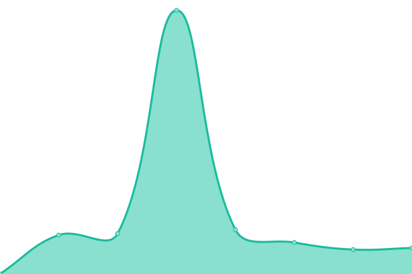
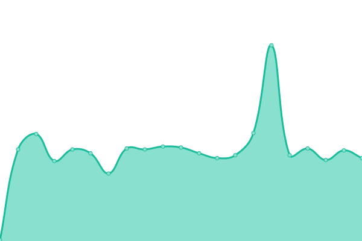
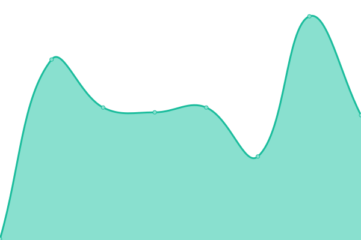

# [📈 Live Status](https://hkfires.github.io/WebStatusMonitor): <!--live status--> **🟧 Partial outage**

This repository contains the open-source uptime monitor and status page for [hkfires](https://hkfires.github.io/WebStatusMonitor), powered by [Upptime](https://github.com/upptime/upptime).

With [Upptime](https://upptime.js.org), you can get your own unlimited and free uptime monitor and status page, powered entirely by a GitHub repository. We use [Issues](https://github.com/hkfires/WebStatusMonitor/issues) as incident reports, [Actions](https://github.com/hkfires/WebStatusMonitor/actions) as uptime monitors, and [Pages](https://hkfires.github.io/WebStatusMonitor) for the status page.

<!--start: status pages-->
<!-- This summary is generated by Upptime (https://github.com/upptime/upptime) -->
<!-- Do not edit this manually, your changes will be overwritten -->
<!-- prettier-ignore -->
| URL | Status | History | Response Time | Uptime |
| --- | ------ | ------- | ------------- | ------ |
|  Serv00-1 | 🟩 Up | [serv00-1.yml](https://github.com/hkfires/WebStatusMonitor/commits/HEAD/history/serv00-1.yml) | 

 641ms
     
 | 

<a href="https://webstatus.us.kg/history/serv00-1">100.00%</a>
    

|  Serv00-2 | 🟥 Down | [serv00-2.yml](https://github.com/hkfires/WebStatusMonitor/commits/HEAD/history/serv00-2.yml) | 

 0ms
     
 | 

<a href="https://webstatus.us.kg/history/serv00-2">0.00%</a>
    

|  Serv00-3 | 🟩 Up | [serv00-3.yml](https://github.com/hkfires/WebStatusMonitor/commits/HEAD/history/serv00-3.yml) | 

 577ms
     
 | 

<a href="https://webstatus.us.kg/history/serv00-3">100.00%</a>
    

|  Serv00-4 | 🟥 Down | [serv00-4.yml](https://github.com/hkfires/WebStatusMonitor/commits/HEAD/history/serv00-4.yml) | 

 0ms
     
 | 

<a href="https://webstatus.us.kg/history/serv00-4">0.00%</a>
    

|  Serv00-5 | 🟥 Down | [serv00-5.yml](https://github.com/hkfires/WebStatusMonitor/commits/HEAD/history/serv00-5.yml) | 

 618ms
     
 | 

<a href="https://webstatus.us.kg/history/serv00-5">0.00%</a>
    

|  CT8 | 🟩 Up | [ct-8.yml](https://github.com/hkfires/WebStatusMonitor/commits/HEAD/history/ct-8.yml) | 

 702ms
     
 | 

<a href="https://webstatus.us.kg/history/ct-8">99.11%</a>
    

|  Bot-CT8 | 🟩 Up | [bot-ct-8.yml](https://github.com/hkfires/WebStatusMonitor/commits/HEAD/history/bot-ct-8.yml) | 

 1168ms
     
 | 

<a href="https://webstatus.us.kg/history/bot-ct-8">99.76%</a>
    

|  [Test-Site](https://lucynana.serv00.net) | 🟩 Up | [test-site.yml](https://github.com/hkfires/WebStatusMonitor/commits/HEAD/history/test-site.yml) | 

 691ms
     
 | 

<a href="https://webstatus.us.kg/history/test-site">100.00%</a>
    

|  [Google](https://www.google.com) | 🟩 Up | [google.yml](https://github.com/hkfires/WebStatusMonitor/commits/HEAD/history/google.yml) | 

 83ms
     
 | 

<a href="https://webstatus.us.kg/history/google">100.00%</a>
    

|  [Baidu](https://www.baidu.com/) | 🟩 Up | [baidu.yml](https://github.com/hkfires/WebStatusMonitor/commits/HEAD/history/baidu.yml) | 

 2493ms
     
 | 

<a href="https://webstatus.us.kg/history/baidu">100.00%</a>
    

|  [Cloudflare](https://www.cloudflare.com/) | 🟩 Up | [cloudflare.yml](https://github.com/hkfires/WebStatusMonitor/commits/HEAD/history/cloudflare.yml) | 

 1132ms
     
 | 

<a href="https://webstatus.us.kg/history/cloudflare">100.00%</a>
    

<!--end: status pages-->

## 📄 License

- Powered by: [Upptime](https://github.com/upptime/upptime)
- Code: [MIT](./LICENSE) © [Anand Chowdhary](https://anandchowdhary.com), supported by [Pabio](https://pabio.com)
- Data in the `./history` directory: [Open Database License](https://opendatacommons.org/licenses/odbl/1-0/)
